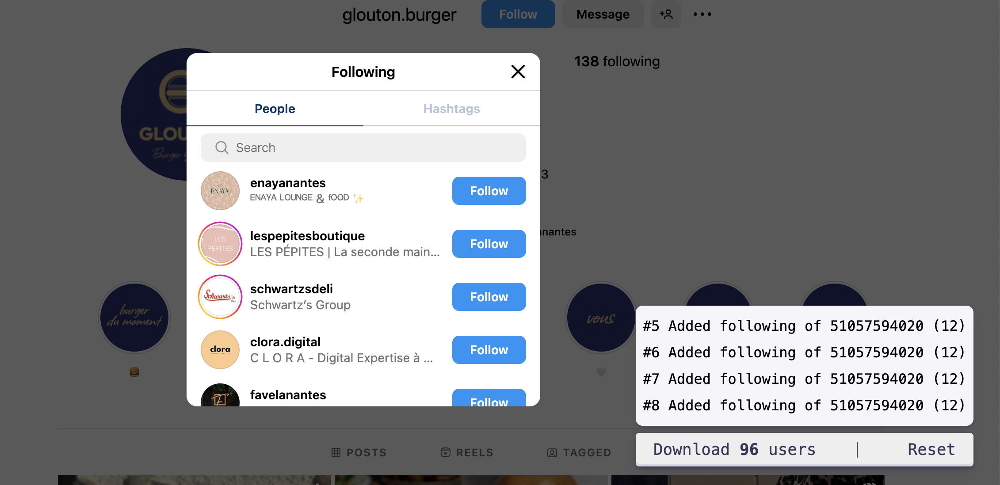

# Free Instagram Scraper (Followers, Following list, Post authors)

Script to scrape Instagram users and export them into a CSV file. This Instagram user exporter works in the browser, without installing an extension or using a proxy. Just copy-paste the script into your Chrome console.

What can be extracted:
- Instagram profile followers
- Instagram profile following
- Users from posts on an Instagram Location page
- Users from posts on an Instagram Tag page
- Users from post on the Explore page


## How to run the Instagram Users Extractor script

 1. Go to Instagram
 1. Open Chrome Developer Console
 1. Copy Paste the following code into the console. It will add a "Download 0 users" button. **Important: Copy/Paste before moving to any tag, location, or profile page**
 1. Navigate to one of the following
    - The modal listing the Instagram followers
    - The modal listing the Instagram following users
    - A Location or Tag page
    - The Explore page
 1. Scroll to load new users that will get scraped by the script. The button counter increases with new users scraped.
 1. Once done, click on the "Download X users" button to download the generated CSV file
 1. The profiles are kept in a cache until you click the "Reset" button. Thanks to this cache, the extracted profiles are still available if your browser "crashes"


 Read our step-by-step [guide to scrape Instagram users and enrich them](https://www.datablist.com/how-to/scrape-instagram-users-free-followers-followings-authors)

## Scrapped Fields

- **Profile Id**: Unique Instagram identifier. Multi-digit number.
- **Username**: Instagram username.
- **Link**: Instagram profile url. In the format https://www.instagram.com/{{username}}
- **Full Name**: Instagram user's full name
- **Is Private**: Is the profile private
- **Location**: The location name for post author scraping. When available.
- **Picture Url**: Instagram user profile picture
- **Source**: Information about where the user was scrapped. Followers, Following, Post Authors, Explore section, etc.


The generated script is located in `dist/main.min.js`.

> [dist/main.min.js](dist/main.min.js)

```javascript
function exportToCsv(e,t){for(var n="",r=0;r<t.length;r++)n+=function(e){for(var t="",n=0;n<e.length;n++){var r=null===e[n]||void 0===e[n]?"":e[n].toString(),r=(r=e[n]instanceof Date?e[n].toLocaleString():r).replace(/"/g,'""');0<n&&(t+=","),t+=r=0<=r.search(/("|,|\n)/g)?'"'+r+'"':r}return t+"\n"}(t[r]);var o=new Blob([n],{type:"text/csv;charset=utf-8;"}),i=document.createElement("a");void 0!==i.download&&(o=URL.createObjectURL(o),i.setAttribute("href",o),i.setAttribute("download",e),document.body.appendChild(i),i.click(),document.body.removeChild(i))}const instanceOfAny=(t,e)=>e.some(e=>t instanceof e);let idbProxyableTypes,cursorAdvanceMethods;function getIdbProxyableTypes(){return idbProxyableTypes=idbProxyableTypes||[IDBDatabase,IDBObjectStore,IDBIndex,IDBCursor,IDBTransaction]}function getCursorAdvanceMethods(){return cursorAdvanceMethods=cursorAdvanceMethods||[IDBCursor.prototype.advance,IDBCursor.prototype.continue,IDBCursor.prototype.continuePrimaryKey]}const transactionDoneMap=new WeakMap,transformCache=new WeakMap,reverseTransformCache=new WeakMap;function promisifyRequest(i){var e=new Promise((e,t)=>{const n=()=>{i.removeEventListener("success",r),i.removeEventListener("error",o)},r=()=>{e(wrap(i.result)),n()},o=()=>{t(i.error),n()};i.addEventListener("success",r),i.addEventListener("error",o)});return reverseTransformCache.set(e,i),e}function cacheDonePromiseForTransaction(i){var e;transactionDoneMap.has(i)||(e=new Promise((e,t)=>{const n=()=>{i.removeEventListener("complete",r),i.removeEventListener("error",o),i.removeEventListener("abort",o)},r=()=>{e(),n()},o=()=>{t(i.error||new DOMException("AbortError","AbortError")),n()};i.addEventListener("complete",r),i.addEventListener("error",o),i.addEventListener("abort",o)}),transactionDoneMap.set(i,e))}let idbProxyTraps={get(e,t,n){if(e instanceof IDBTransaction){if("done"===t)return transactionDoneMap.get(e);if("store"===t)return n.objectStoreNames[1]?void 0:n.objectStore(n.objectStoreNames[0])}return wrap(e[t])},set(e,t,n){return e[t]=n,!0},has(e,t){return e instanceof IDBTransaction&&("done"===t||"store"===t)||t in e}};function replaceTraps(e){idbProxyTraps=e(idbProxyTraps)}function wrapFunction(t){return getCursorAdvanceMethods().includes(t)?function(...e){return t.apply(unwrap(this),e),wrap(this.request)}:function(...e){return wrap(t.apply(unwrap(this),e))}}function transformCachableValue(e){return"function"==typeof e?wrapFunction(e):(e instanceof IDBTransaction&&cacheDonePromiseForTransaction(e),instanceOfAny(e,getIdbProxyableTypes())?new Proxy(e,idbProxyTraps):e)}function wrap(e){if(e instanceof IDBRequest)return promisifyRequest(e);if(transformCache.has(e))return transformCache.get(e);var t=transformCachableValue(e);return t!==e&&(transformCache.set(e,t),reverseTransformCache.set(t,e)),t}const unwrap=e=>reverseTransformCache.get(e);function openDB(e,t,{blocked:n,upgrade:r,blocking:o,terminated:i}={}){const s=indexedDB.open(e,t),a=wrap(s);return r&&s.addEventListener("upgradeneeded",e=>{r(wrap(s.result),e.oldVersion,e.newVersion,wrap(s.transaction),e)}),n&&s.addEventListener("blocked",e=>n(e.oldVersion,e.newVersion,e)),a.then(e=>{i&&e.addEventListener("close",()=>i()),o&&e.addEventListener("versionchange",e=>o(e.oldVersion,e.newVersion,e))}).catch(()=>{}),a}const readMethods=["get","getKey","getAll","getAllKeys","count"],writeMethods=["put","add","delete","clear"],cachedMethods=new Map;function getMethod(e,t){if(e instanceof IDBDatabase&&!(t in e)&&"string"==typeof t){if(cachedMethods.get(t))return cachedMethods.get(t);const r=t.replace(/FromIndex$/,""),o=t!==r,i=writeMethods.includes(r);return r in(o?IDBIndex:IDBObjectStore).prototype&&(i||readMethods.includes(r))?(e=async function(e,...t){e=this.transaction(e,i?"readwrite":"readonly");let n=e.store;return o&&(n=n.index(t.shift())),(await Promise.all([n[r](...t),i&&e.done]))[0]},cachedMethods.set(t,e),e):void 0}}replaceTraps(r=>({...r,get:(e,t,n)=>getMethod(e,t)||r.get(e,t,n),has:(e,t)=>!!getMethod(e,t)||r.has(e,t)}));const advanceMethodProps=["continue","continuePrimaryKey","advance"],methodMap={},advanceResults=new WeakMap,ittrProxiedCursorToOriginalProxy=new WeakMap,cursorIteratorTraps={get(e,t){if(!advanceMethodProps.includes(t))return e[t];let n=methodMap[t];return n=n||(methodMap[t]=function(...e){advanceResults.set(this,ittrProxiedCursorToOriginalProxy.get(this)[t](...e))})}};async function*iterate(...e){let t=this;if(t=t instanceof IDBCursor?t:await t.openCursor(...e)){t=t;var n=new Proxy(t,cursorIteratorTraps);for(ittrProxiedCursorToOriginalProxy.set(n,t),reverseTransformCache.set(n,unwrap(t));t;)yield n,t=await(advanceResults.get(n)||t.continue()),advanceResults.delete(n)}}function isIteratorProp(e,t){return t===Symbol.asyncIterator&&instanceOfAny(e,[IDBIndex,IDBObjectStore,IDBCursor])||"iterate"===t&&instanceOfAny(e,[IDBIndex,IDBObjectStore])}replaceTraps(r=>({...r,get(e,t,n){return isIteratorProp(e,t)?iterate:r.get(e,t,n)},has(e,t){return isIteratorProp(e,t)||r.has(e,t)}}));var __awaiter$1=function(e,s,a,l){return new(a=a||Promise)(function(n,t){function r(e){try{i(l.next(e))}catch(e){t(e)}}function o(e){try{i(l.throw(e))}catch(e){t(e)}}function i(e){var t;e.done?n(e.value):((t=e.value)instanceof a?t:new a(function(e){e(t)})).then(r,o)}i((l=l.apply(e,s||[])).next())})},__rest=function(e,t){var n={};for(o in e)Object.prototype.hasOwnProperty.call(e,o)&&t.indexOf(o)<0&&(n[o]=e[o]);if(null!=e&&"function"==typeof Object.getOwnPropertySymbols)for(var r=0,o=Object.getOwnPropertySymbols(e);r<o.length;r++)t.indexOf(o[r])<0&&Object.prototype.propertyIsEnumerable.call(e,o[r])&&(n[o[r]]=e[o[r]]);return n};class ListStorage{constructor(e){this.name="scrape-storage",this.persistent=!0,this.data=new Map,null!=e&&e.name&&(this.name=e.name),null!=e&&e.persistent&&(this.persistent=e.persistent),this.initDB().then(()=>{}).catch(()=>{this.persistent=!1})}get storageKey(){return"storage-"+this.name}initDB(){return __awaiter$1(this,void 0,void 0,function*(){this.db=yield openDB(this.storageKey,6,{upgrade(e,t,n,r){let o;if(t<5)try{e.deleteObjectStore("data")}catch(e){}(o=e.objectStoreNames.contains("data")?r.objectStore("data"):e.createObjectStore("data",{keyPath:"_id",autoIncrement:!0}))&&!o.indexNames.contains("_createdAt")&&o.createIndex("_createdAt","_createdAt"),o&&!o.indexNames.contains("_groupId")&&o.createIndex("_groupId","_groupId"),o&&!o.indexNames.contains("_pk")&&o.createIndex("_pk","_pk",{unique:!0})}})})}_dbGetElem(t,n){return __awaiter$1(this,void 0,void 0,function*(){if(this.persistent&&this.db){const e=(n=n||this.db.transaction("data","readonly")).store;return yield e.index("_pk").get(t)}throw new Error("DB doesnt exist")})}getElem(e){return __awaiter$1(this,void 0,void 0,function*(){if(this.persistent&&this.db)try{return yield this._dbGetElem(e)}catch(e){console.error(e)}else this.data.get(e)})}_dbSetElem(o,i,s=!1,a,l){return __awaiter$1(this,void 0,void 0,function*(){if(this.persistent&&this.db){let e=!1;const n=(l=l||this.db.transaction("data","readwrite")).store;var t=yield n.index("_pk").get(o);if(t)s&&(yield n.put(Object.assign(Object.assign({},t),i)),e=!0);else{const r=Object.assign({_pk:o,_createdAt:new Date},i);a&&(r._groupId=a),yield n.put(r),e=!0}return e}throw new Error("DB doesnt exist")})}addElem(e,t,n=!1,r){return __awaiter$1(this,void 0,void 0,function*(){if(this.persistent&&this.db)try{return yield this._dbSetElem(e,t,n,r)}catch(e){console.error(e)}else this.data.set(e,t);return!0})}addElems(t,i=!1,s){return __awaiter$1(this,void 0,void 0,function*(){if(this.persistent&&this.db){const n=[],r=this.db.transaction("data","readwrite"),o=[];if(t.forEach(([e,t])=>{-1===o.indexOf(e)&&(o.push(e),n.push(this._dbSetElem(e,t,i,s,r)))}),0<n.length){n.push(r.done);const e=yield Promise.all(n);let t=0;return e.forEach(e=>{"boolean"==typeof e&&e&&(t+=1)}),t}return 0}return t.forEach(([e,t])=>{this.addElem(e,t)}),t.length})}deleteFromGroupId(r){return __awaiter$1(this,void 0,void 0,function*(){if(this.persistent&&this.db){let e=0;const n=this.db.transaction("data","readwrite");let t=yield n.store.index("_groupId").openCursor(IDBKeyRange.only(r));for(;t;)t.delete(),t=yield t.continue(),e+=1;return e}throw new Error("Not Implemented Error")})}clear(){return __awaiter$1(this,void 0,void 0,function*(){this.persistent&&this.db?yield this.db.clear("data"):this.data.clear()})}getCount(){return __awaiter$1(this,void 0,void 0,function*(){return this.persistent&&this.db?yield this.db.count("data"):this.data.size})}getAll(){return __awaiter$1(this,void 0,void 0,function*(){if(this.persistent&&this.db){const n=new Map,e=yield this.db.getAll("data");return e&&e.forEach(e=>{var t=e["_id"],e=__rest(e,["_id"]);n.set(t,e)}),n}return this.data})}toCsvData(){return __awaiter$1(this,void 0,void 0,function*(){const t=[],e=(t.push(this.headers),yield this.getAll());return e.forEach(e=>{try{t.push(this.itemToRow(e))}catch(e){console.error(e)}}),t})}}const btnStyles=["display: block;","padding: 0px 4px;","cursor: pointer;","text-align: center;"];function createCta(e){const t=document.createElement("div"),n=[...btnStyles];return e&&n.push("flex-grow: 1;"),t.setAttribute("style",n.join("")),t}const spacerStyles=["margin-left: 4px;","margin-right: 4px;","border-left: 1px solid #2e2e2e;"];function createSpacer(){const e=document.createElement("div");return e.innerHTML="&nbsp;",e.setAttribute("style",spacerStyles.join("")),e}function createTextSpan(e,t){var n,t=t||{};let r;const o=document.createElement("span");return(r=t.bold?(n=document.createElement("strong"),o.append(n),n):o).textContent=e,t.idAttribute&&r.setAttribute("id",t.idAttribute),o}const canvasStyles=["position: fixed;","top: 0;","left: 0;","z-index: 10000;","width: 100%;","height: 100%;","pointer-events: none;"],innerStyles=["position: absolute;","bottom: 30px;","right: 30px;","width: auto;","pointer-events: auto;"],ctaContainerStyles=["align-items: center;","appearance: none;","background-color: #EEE;","border-radius: 4px;","border-width: 0;","box-shadow: rgba(45, 35, 66, 0.4) 0 2px 4px,rgba(45, 35, 66, 0.3) 0 7px 13px -3px,#D6D6E7 0 -3px 0 inset;","box-sizing: border-box;","color: #36395A;","display: flex;","font-family: monospace;","height: 38px;","justify-content: space-between;","line-height: 1;","list-style: none;","overflow: hidden;","padding-left: 16px;","padding-right: 16px;","position: relative;","text-align: left;","text-decoration: none;","user-select: none;","white-space: nowrap;","font-size: 18px;"];class UIContainer{constructor(){this.ctas=[],this.canva=document.createElement("div"),this.canva.setAttribute("style",canvasStyles.join("")),this.inner=document.createElement("div"),this.inner.setAttribute("style",innerStyles.join("")),this.canva.appendChild(this.inner),this.history=document.createElement("div"),this.inner.appendChild(this.history),this.container=document.createElement("div"),this.container.setAttribute("style",ctaContainerStyles.join("")),this.inner.appendChild(this.container)}render(){document.body.appendChild(this.canva)}addCta(e,t){void 0===t?this.ctas.push(e):this.ctas.splice(t,0,e),this.container.innerHTML="",this.ctas.forEach(e=>{this.container.appendChild(e)})}}function randomString(t){var n="abcdefghijklmnopqrstuvwxyzABCDEFGHIJKLMNOPQRSTUVWXYZ0123456789",r=n.length;let o="";for(let e=0;e<t;e++)o+=n.charAt(Math.floor(Math.random()*r));return o}var __awaiter=function(e,s,a,l){return new(a=a||Promise)(function(n,t){function r(e){try{i(l.next(e))}catch(e){t(e)}}function o(e){try{i(l.throw(e))}catch(e){t(e)}}function i(e){var t;e.done?n(e.value):((t=e.value)instanceof a?t:new a(function(e){e(t)})).then(r,o)}i((l=l.apply(e,s||[])).next())})};const historyPanelStyles=["text-align: right;","background: #f5f5fa;","padding: 8px;","margin-bottom: 8px;","border-radius: 8px;","font-family: monospace;","font-size: 16px;","box-shadow: rgba(42, 35, 66, 0.2) 0 2px 2px,rgba(45, 35, 66, 0.2) 0 7px 13px -4px;","color: #2f2f2f;"],historyUlStyles=["list-style: none;","margin: 0;"],historyLiStyles=["line-height: 30px;","display: flex;","align-items: center;","justify-content: right;"],deleteIconStyles=["display: flex;","align-items: center;","padding: 4px 12px;","cursor: pointer;"],deleteIconSvg='<svg stroke="currentColor" fill="none" stroke-width="2" viewBox="0 0 24 24" stroke-linecap="round" stroke-linejoin="round" height="16px" width="16px" xmlns="http://www.w3.org/2000/svg"><polyline points="3 6 5 6 21 6"></polyline><path d="M19 6v14a2 2 0 0 1-2 2H7a2 2 0 0 1-2-2V6m3 0V4a2 2 0 0 1 2-2h4a2 2 0 0 1 2 2v2"></path></svg>';class HistoryTracker{constructor({onDelete:e,divContainer:t,maxLogs:n}){this.maxLogs=5,this.logs=[],this.panelRef=null,this.counter=0,this.onDelete=e,this.container=t,n&&(this.maxLogs=n)}renderPanel(){const e=document.createElement("div");return e.setAttribute("style",historyPanelStyles.join("")),e}renderLogs(){if(this.panelRef&&this.panelRef.remove(),0!==this.logs.length){const r=document.createElement("ul"),e=(r.setAttribute("style",historyUlStyles.join("")),this.logs.forEach(t=>{const e=document.createElement("li");if(e.setAttribute("style",historyLiStyles.join("")),e.innerHTML=`<div>#${t.index} ${t.label} (${t.numberItems})</div>`,t.cancellable){const n=document.createElement("div");n.setAttribute("style",deleteIconStyles.join("")),n.innerHTML=deleteIconSvg,n.addEventListener("click",()=>__awaiter(this,void 0,void 0,function*(){yield this.onDelete(t.groupId);var e=this.logs.findIndex(e=>e.index===t.index);-1!==e&&(this.logs.splice(e,1),this.renderLogs())})),e.append(n)}r.prepend(e)}),this.renderPanel());e.appendChild(r),this.panelRef=e,this.container.appendChild(e)}}addHistoryLog({label:e,groupId:t,numberItems:n,cancellable:r}){this.counter+=1;e={index:this.counter,label:e,groupId:t,numberItems:n,cancellable:r,createdAt:new Date};this.logs.unshift(e),this.logs.length>this.maxLogs&&this.logs.splice(this.maxLogs),this.renderLogs()}cleanLogs(){this.logs=[],this.counter=0,this.renderLogs()}}class FBStorage extends ListStorage{get headers(){return["Profile Id","Username","Link","Full Name","Is Private","Location","Picture Url","Source"]}itemToRow(e){var t="https://www.instagram.com/"+e.username;let n="";return"boolean"==typeof e.isPrivate&&(n=e.isPrivate?"true":"false"),[e.profileId,e.username,t,e.fullName,n,e.location||"",e.pictureUrl,e.source||""]}}const memberListStore=new FBStorage({name:"insta-scrape"}),counterId="scraper-number-tracker",exportName="instaExport";let logsTracker;async function updateConter(){const e=document.getElementById(counterId);if(e){const t=await memberListStore.getCount();e.textContent=t.toString()}}const uiWidget=new UIContainer;function buildCTABtns(){logsTracker=new HistoryTracker({onDelete:async e=>{console.log("Delete "+e),await memberListStore.deleteFromGroupId(e),await updateConter()},divContainer:uiWidget.history,maxLogs:4});const e=createCta(),t=(e.appendChild(createTextSpan("Download ")),e.appendChild(createTextSpan("0",{bold:!0,idAttribute:counterId})),e.appendChild(createTextSpan(" users")),e.addEventListener("click",async function(){var e=(new Date).toISOString(),t=await memberListStore.toCsvData();try{exportToCsv(exportName+`-${e}.csv`,t)}catch(e){console.error("Error while generating export"),console.log(e.stack)}}),uiWidget.addCta(e),uiWidget.addCta(createSpacer()),createCta());t.appendChild(createTextSpan("Reset")),t.addEventListener("click",async function(){await memberListStore.clear(),logsTracker.cleanLogs(),await updateConter()}),uiWidget.addCta(t),uiWidget.render(),window.setTimeout(()=>{updateConter()},1e3)}let sourceGlobal=null;function processResponseUsers(e,i){let t;if(null!=e&&e.users){const n=(t=e.users).map(e=>{var{pk:e,username:t,full_name:n,is_private:r,profile_pic_url:o}=e;return{profileId:e,username:t,fullName:n,source:i,isPrivate:r,pictureUrl:o}}),r=[],o=(n.forEach(e=>{e&&r.push([e.profileId,e])}),randomString(10));memberListStore.addElems(r,!1,o).then(e=>{updateConter(),logsTracker.addHistoryLog({label:i?"Added "+i:"Added items",numberItems:e,groupId:o,cancellable:!1})})}}const locationNameCache={};function saveLocationName(e,t){locationNameCache[e]=t}function sourceString(e,t){switch(e){case"location":return t?locationNameCache[t]?`post authors (loc: ${locationNameCache[t]})`:"string"==typeof t&&t.startsWith("%23")?`post authors (loc: ${t.replace("%23","")})`:`post authors (loc: ${t})`:"post authors";case"tag":if(t){let e=t;return"post authors #"+(e="string"==typeof t&&t.startsWith("%23")?t.replace("%23",""):e)}return"post authors";case"followers":return"followers of "+t;case"following":return"following of "+t}}function processResponse(e,t){var n,r;let o,i=null;if(null!=e&&e.data)sourceGlobal=null==(r=null==e?void 0:e.data)?void 0:r.name,o=[],null!=(r=null==(r=null==e?void 0:e.data)?void 0:r.recent)&&r.sections&&o.push(...null==(r=null==(r=null==e?void 0:e.data)?void 0:r.recent)?void 0:r.sections),null!=(r=null==(r=null==e?void 0:e.data)?void 0:r.top)&&r.sections&&o.push(...null==(r=null==(r=null==e?void 0:e.data)?void 0:r.top)?void 0:r.sections),null!=(r=null==(r=null==e?void 0:e.data)?void 0:r.xdt_location_get_web_info_tab)&&r.edges&&o.push(...null==(r=null==(r=null==e?void 0:e.data)?void 0:r.xdt_location_get_web_info_tab)?void 0:r.edges);else if(null!=(r=null==e?void 0:e.media_grid)&&r.sections)o=null==(r=null==e?void 0:e.media_grid)?void 0:r.sections;else if(null!=e&&e.native_location_data)null!=(r=null==(r=null==e?void 0:e.native_location_data)?void 0:r.location_info)&&r.name&&(r=e.native_location_data.location_info.name,saveLocationName(null==(n=null==(n=null==e?void 0:e.native_location_data)?void 0:n.location_info)?void 0:n.location_id,r),i=sourceString("location",null==(r=null==(n=null==e?void 0:e.native_location_data)?void 0:n.location_info)?void 0:r.location_id),sourceGlobal=i),o=[],null!=(r=null==(n=null==e?void 0:e.native_location_data)?void 0:n.ranked)&&r.sections&&o.push(...null==(r=null==(n=null==e?void 0:e.native_location_data)?void 0:n.ranked)?void 0:r.sections),null!=(r=null==(n=null==e?void 0:e.native_location_data)?void 0:n.recent)&&r.sections&&o.push(...null==(r=null==(n=null==e?void 0:e.native_location_data)?void 0:n.recent)?void 0:r.sections);else{if(null==e||!e.sections)return;o=null==e?void 0:e.sections}const s=[];if(o.forEach(e=>{var t=null==(t=null==e?void 0:e.layout_content)?void 0:t.medias,t=(t&&0<t.length&&s.push(...t),null==(t=null==e?void 0:e.layout_content)?void 0:t.fill_items);t&&0<t.length&&s.push(...t),null!=e&&e.node&&s.push(null==e?void 0:e.node)}),0!==s.length){let c=i||t||sourceGlobal;const a=s.map(e=>{var t;let n=null==e?void 0:e.media;if(!(n=n||"XDTMediaDict"!=e.__typename?n:e))return null;e=null==n?void 0:n.owner;if(!e)return null;var{pk:e,username:r,full_name:o,is_private:i,profile_pic_url:s}=e;let a=null;null!=(t=null==n?void 0:n.location)&&t.name&&(a=null==(t=null==n?void 0:n.location)?void 0:t.name);const l={profileId:e,username:r,fullName:o,isPrivate:i,pictureUrl:s};return null==l.isPrivate&&null!=n&&n.user&&void 0!==n.user.is_private&&(l.isPrivate=n.user.is_private),a&&(l.location=a),c&&(l.source=c),l}),l=[],d=(a.forEach(e=>{e&&l.push([e.profileId,e])}),randomString(10));memberListStore.addElems(l,!1,d).then(e=>{updateConter(),logsTracker.addHistoryLog({label:c?"Added "+c:"Added items",numberItems:e,groupId:d,cancellable:!1})})}}function parseResponseExplore(e){const t=null==e?void 0:e.sectional_items;if(t){const n=[];if(t.forEach(e=>{var t;null!=(t=null==e?void 0:e.layout_content)&&t.fill_items&&n.push(...null==(t=null==e?void 0:e.layout_content)?void 0:t.fill_items)}),0!==n.length){const r=n.map(e=>{e=null==e?void 0:e.media;if(!e)return null;var{pk:e,username:t,full_name:n,is_private:r,profile_pic_url:o}=null==e?void 0:e.owner;return{profileId:e,username:t,fullName:n,isPrivate:r,pictureUrl:o,source:"Explore"}}),o=[],i=(r.forEach(e=>{e&&o.push([e.profileId,e])}),randomString(10));memberListStore.addElems(o,!1,i).then(e=>{updateConter(),logsTracker.addHistoryLog({label:"Added items from explore",numberItems:e,groupId:i,cancellable:!1})})}}}function parseResponse(e,t,n){let r=[];try{r.push(JSON.parse(e))}catch(t){var o=e.split("\n");if(o.length<=1)return void console.error("Fail to parse API response",t);for(let e=0;e<o.length;e++){var i=o[e];try{r.push(JSON.parse(i))}catch(e){console.error("Fail to parse API response",t)}}}for(let e=0;e<r.length;e++)if("section"==t)try{processResponse(r[e],n)}catch(e){console.error(e)}else if("users"==t)try{processResponseUsers(r[e],n)}catch(e){console.error(e)}else if("explore"==t)try{parseResponseExplore(r[e])}catch(e){console.error(e)}}const profileUsernamesCache={};async function quickProfileIdLookup(e){if("string"==typeof profileUsernamesCache[e])return profileUsernamesCache[e];var t=await memberListStore.getElem(e);return t?(profileUsernamesCache[e]=t.username,t.username):null}function main(){buildCTABtns();const c=/\/api\/v1\/tags\/web_info\/\?tag_name=(?<tag_name>[\w|_|-]+)/i,d=/\/api\/v1\/locations\/web_info\/?location_id=(?<location_id>[\w|_|-]+)/i,u=/\/api\/v1\/fbsearch\/web\/top_serp\/\?(?:[\w|_|-|&|=]+)query=(?<tag_name>[\w|_|-|%]+)/i,p=/\/api\/v1\/locations\/(?<location_id>[\w|\d]+)\/sections\//i,e=/\/api\/v1\/[\w|\d|\/]+\/sections\//i,h=/explore\/locations\/(\d+)\/(?<location_slug>[\w|-]+)\/?/i,f=/\/api\/v1\/friendships\/(?<profile_id>\d+)\/followers\//i,v=/\/api\/v1\/friendships\/(?<profile_id>\d+)\/following\//i;let t=XMLHttpRequest.prototype.send;XMLHttpRequest.prototype.send=function(){this.addEventListener("readystatechange",function(){var t;if(4===this.readyState)if(this.responseURL.includes("/api/v1/tags/web_info")){let e;var n=c.exec(this.responseURL);n&&null!=(r=null==n?void 0:n.groups)&&r.tag_name&&(e=n.groups.tag_name),parseResponse(this.responseText,"section",sourceString("tag",e))}else if(this.responseURL.includes("/api/v1/locations/web_info")){let e;var r=d.exec(this.responseURL);r&&null!=(o=null==r?void 0:r.groups)&&o.location_id&&(e=r.groups.location_id),parseResponse(this.responseText,"section",sourceString("tag",e))}else if(this.responseURL.includes("/graphql/query")){var o,n=h.exec(window.location.href);n&&null!=(i=null==n?void 0:n.groups)&&i.location_slug&&(o=n.groups.location_slug,parseResponse(this.responseText,"section",sourceString("tag",o)))}else if(this.responseURL.includes("/api/v1/fbsearch/web/top_serp")){let e;var r=u.exec(this.responseURL);r&&null!=(s=null==r?void 0:r.groups)&&s.tag_name&&(e=r.groups.tag_name),parseResponse(this.responseText,"section",sourceString("tag",e))}else if(this.responseURL.match(p)){let e;var i=p.exec(this.responseURL);p.lastIndex=0,i&&null!=(t=null==i?void 0:i.groups)&&t.location_id&&(e=i.groups.location_id),parseResponse(this.responseText,"section",sourceString("location",e))}else if(this.responseURL.match(e)||this.responseURL.includes("/api/v1/tags/web_info"))parseResponse(this.responseText,"section","post authors");else if(this.responseURL.includes("/api/v1/discover/web/explore_grid"))parseResponse(this.responseText,"explore","explore");else{n=f.exec(this.responseURL);if(f.lastIndex=0,n){const a=null==(o=null==n?void 0:n.groups)?void 0:o.profile_id;a&&quickProfileIdLookup(a).then(e=>{let t=""+a;e&&(t=a+` (${e})`),parseResponse(this.responseText,"users",sourceString("followers",t))})}else{var s=v.exec(this.responseURL);if(v.lastIndex=0,s){const l=null==(r=null==s?void 0:s.groups)?void 0:r.profile_id;l&&quickProfileIdLookup(l).then(e=>{let t=""+l;e&&(t=l+` (${e})`),parseResponse(this.responseText,"users",sourceString("following",t))})}}}},!1),t.apply(this,arguments)}}main();
```

## Instagram Followers/Following/Post Author Extractor tutorial with screenshots

**Open Chrome Developer Console**

To open the Chrome Developer console on Chrome, use the keyboard shortcut `Ctrl + Shift + I` (on Windows) or `Cmd + Option + I` (on Mac).


**Copy Paste the script**

Select the "Console" tab and copy-paste the script from above. Instagram shows a warning message in the "Console" asking not to  paste a script from a non-trustworthy source. It's true! And if you don't trust this script, stop here. [Read the source code](src/main.ts) to understand what this script does.


**Scrape Instagram Followers, Following users, and Post authors**

The script intercepts users' data as they are loaded by Instagram to be displayed. The script scrapes "Followers", "Following", and tag or location pages.

If the counter in the button text increases as you navigate, it's working!




**Export users in CSV format**

Once finished, or to perform "export checkpoints", click the button "Download X users". A Download window will prompt asking where to save your CSV file.


**Edit and view your CSV file**

[To load and view the CSV file](https://www.datablist.com/csv-editor), use [Datablist.com](https://www.datablist.com/) or any spreadsheet tools.


**Manage your Instagram leads and enrich them with Instagram Profile Scraper**

Extracted Instagram users contain a limited number of fields ([see the list](#scrapped-fields)). To enrich your users with additional information from Instagram, you can use Datablist [Instagram Profile Scraper](https://www.datablist.com/enrichments/instagram-profile-scraper-bulk).

You will be able to get the bio, country, public email address, public phone number, etc. for each profile.

Follow our step-by-step tutorial to [scrape Instagram users and enrich their profile](https://www.datablist.com/how-to/scrape-instagram-users-free-followers-followings-authors).


## FAQ

- **How to remove the "Download" button?**
    - Just reload your Instagram page. Any javascript code added in Chrome Developer Console will be removed.
- **How many users can be extracted?**
    - The script stores the extracted users in a database. There is no limit on the number of users you can extract.
- **Can I extract users from different profiles/tags/locations?**
    - Yes. The exported CSV contains a "Source" attribute. You can extract users from different sources and use the "Source" attribute to segment your data later on.
- **What is the "Reset" button?**
    - The users are stored in a cache in your browser. The cache is kept if your browser restarts the page (intentionally or after a crash). When you copy/paste the script, it loads the previous profiles from the cache. The "Reset" button clears the cache.
- **Is it free?**
    - The script is free and open-source. You can also clean and parse the data with a free account on [Datablist](https://www.datablist.com). To enrich the users with [Instagram Profile Scraper](https://www.datablist.com/enrichments/instagram-profile-scraper-bulk) you have to subscribe to a paid account on [Datablist](https://www.datablist.com). 


## How to build it locally

```
yarn install
yarn build
```


## Other scrapers

- [Scrape Facebook group members](https://github.com/floriandiud/facebook-group-members-scraper)
- [Scrape WhatsApp Group Members](https://github.com/floriandiud/whatsapp-group-members-scraper)